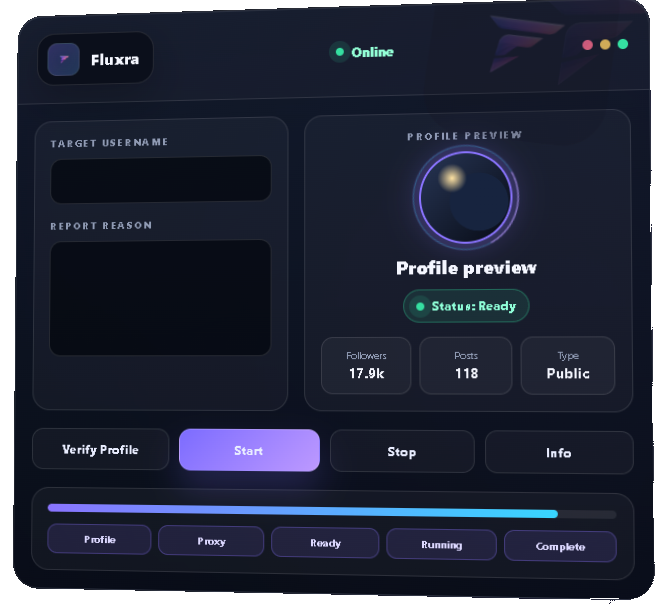

# 🚀 Instagram Mass Report tool
### ⚡ Fast • Reliable  •NO DOWNLOAD NEDEED

 

  

### 🌐 Official Website
### https://fluxra.tech/

## 🎥 Showcase 

  

🎬 Click the image above to watch the full showcase

---

## 📸 Preview

  

 

----

## 💎 Getting Access

### Step 1

Join our official Telegram community.

### Step 2

Receive instructions and latest announcements.

### Step 3

Get access to the Tool and future updates.

## 🌍 Official Website

### Visit Our Website

https://fluxra.tech/

---

## 📊 Platform Status

🕒 Last updated: 2026-06-30 16:25 UTC

## 📬 Contact

### Telegram

https://t.me/Fluxra2

### Website

https://fluxra.tech/

----

# ⭐ Support The Project

If you enjoy the platform and want to stay updated, don't forget to star this repository.

 

## 🚀 Join The Community

 

### 🌐 https://fluxra.tech/

## ⚠️ Educational Purpose Notice

This project is intended for educational, research, and testing purposes only.

Users are fully responsible for their actions and must comply with all applicable laws and platform policies. The creators and contributors accept no liability for misuse or damages resulting from the use of this project.

